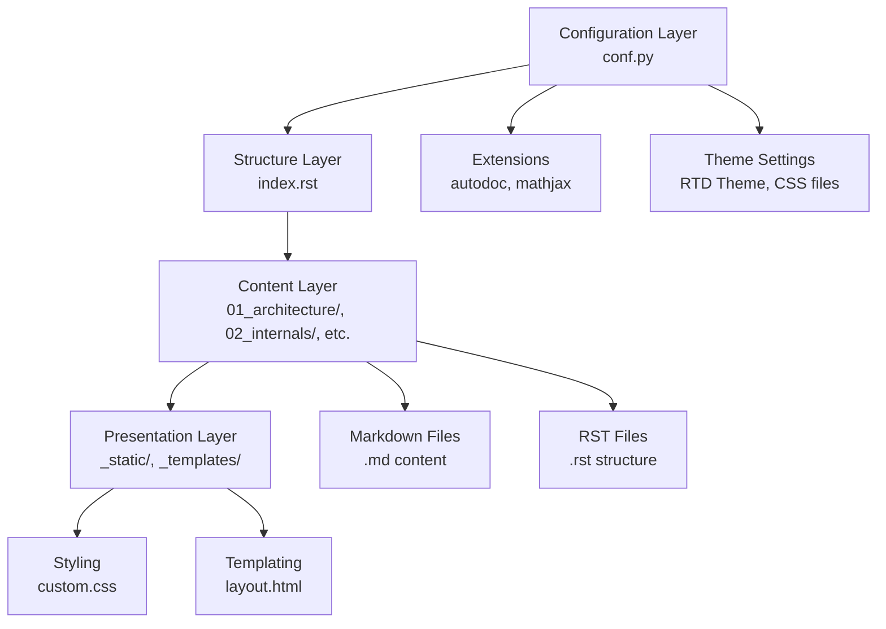

# PorosData Documentation

**PorosData** is a comprehensive scientific data processing suite for AI for Science applications. Our ecosystem includes:

- **PorosData-Parser**: High-quality parsing for PDF, HTML, and scientific documents
- **PorosData-Processor**: Intelligent text cleaning with LaTeX protection and academic standardization
- **PorosData-Designer**: Data annotation, fine-tuning, and training data generation

## 📖 Documentation

Complete documentation is available at: [https://porosdata-doc.readthedocs.io/en/latest/](https://porosdata-doc.readthedocs.io/en/latest/)

**Component Documentation:**
- [PorosData-Processor](https://porosdata-processor.readthedocs.io/) (Current)
- [PorosData-Parser](https://porosdata-parser.readthedocs.io/) (Coming Soon)
- [PorosData-Designer](https://porosdata-designer.readthedocs.io/) (Alpha)

### 📋 Documentation Evolution Status

Our documentation is currently undergoing a major transformation from a **user operations manual** to a **deep architectural kernel** focused on "academic atomicity" principles. This evolution will provide unprecedented insight into PorosData's core design philosophy and technical implementation.

| Phase | Focus Area | Current Status | Target Completion |
|-------|------------|----------------|-------------------|
| 🏗️ **Phase 1: Foundations** | Architecture & Communication Protocols | ✅ **Completed** | Q1 2026 |
| 🧠 **Phase 2: Core Internals** | TextCleaner Engine & Plugin Orchestration | 🔄 **In Progress** | Q2 2026 |
| 🛡️ **Phase 3: Domain Guarding** | LaTeX Protection & Academic Atomicity | 📅 **Planned** | Q3 2026 |
| 🌍 **Phase 4: Ecosystem Enablement** | Developer Protocols & Performance Audits | 📅 **Planned** | Q4 2026 |

**For deep architectural understanding**, please explore our new [Core Design sections](https://porosdata-doc.readthedocs.io/en/latest/#architecture-philosophy) which delve into:
- Component communication contracts and data flow guarantees
- Plugin orchestration internals and atomicity preservation
- Scientific data protection algorithms and academic integrity mechanisms
- Performance trade-offs and security implementations

## 🚀 Quick Start

Please refer to the [Installation Guide](docs_sphinx/installation.md) and [Quick Start](docs_sphinx/quickstart.md).

## 🏗️ Documentation Repository Structure

This guide explains the Sphinx-based documentation repository architecture, helping contributors understand file responsibilities and modification workflows.

### 🗺️ File System Mapping

| Path | Responsibility | Key Files |
|------|----------------|-----------|
| `docs_sphinx/` | **Content Root** - All documentation source files | `*.md`, `*.rst`, `index.rst` |
| `docs_sphinx/_static/` | **Assets Layer** - CSS, images, and custom resources | `custom.css`, logos, icons |
| `docs_sphinx/_templates/` | **Template Layer** - Custom HTML templates and layouts | `page.html`, `layout.html` |
| `docs_sphinx/_build/` | **Output Layer** - Generated HTML (auto-created, don't edit) | `html/`, `doctrees/` |
| `conf.py` | **Configuration Engine** - Controls themes, extensions, and build behavior | Sphinx settings, autodoc config |
| `index.rst` | **Navigation Hub** - Root table of contents linking all documentation | toctree directives |

### ✍️ Developer Modification Guide

#### **Scenario A: Adding Kernel Documentation**
- **Create**: New `.rst` file in appropriate directory (e.g., `04_development/new-plugin-guide.rst`)
- **Register**: Add to `index.rst` toctree under relevant section
- **Build**: Run `make html` to verify navigation integration

#### **Scenario B: Modifying Theme Styling**
- **Edit**: `docs_sphinx/_static/custom.css` for color, font, and layout changes
- **Register**: Ensure `custom.css` is listed in `conf.py` `html_css_files` array
- **Apply**: Changes take effect on next build - no server restart needed

#### **Scenario C: Enabling Code Documentation**
- **Configure**: Add `'sphinx.ext.autodoc'` to `extensions` list in `conf.py`
- **Import**: Use `.. automodule::` directives in `.rst` files
- **Generate**: Run `sphinx-apidoc` to auto-extract docstrings

### 🖼️ Visual Hierarchy Diagram

### 🔧 Quick Workflow Reference

1. **Content Changes**: Edit `.md`/`.rst` files → `make html` → commit
2. **Style Changes**: Edit `custom.css` → `make html` → commit
3. **Structure Changes**: Edit `index.rst` → `make html` → commit
4. **Config Changes**: Edit `conf.py` → `make html` → test thoroughly

**Pro Tip**: Always run `make html` locally before committing to catch formatting errors early!

## 🤝 Contributing

We welcome contributions! Please read our [Contributing Guide](docs_sphinx/contributing.md).

## 📄 License

This project is licensed under the MIT License - see the [LICENSE](LICENSE) file for details.