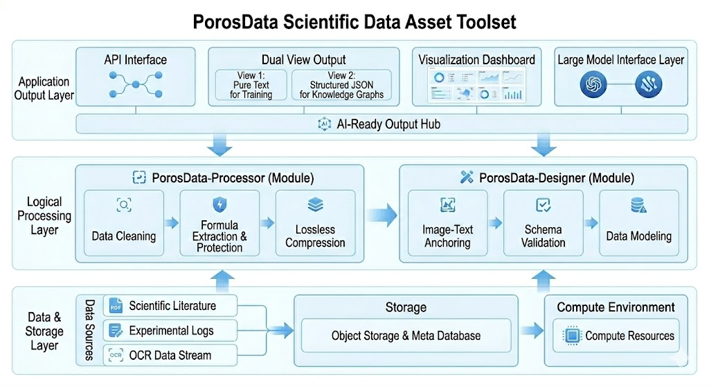

# PorosData

[](https://www.python.org/downloads/)
[](https://opensource.org/licenses/MIT)
[](https://pypi.org/project/porosdata-processor/)

## Introduction

PorosData is a scientific document processing and structured delivery framework. It turns PDFs, OCR outputs, and parser results into data assets that are easier to review, reuse, and deliver downstream.
{: .lead}

In empirical research domains such as materials science, source documents often contain broken numbers, spacing noise, term corruption, damaged formulas, and disconnected figure references. These issues quickly affect model training, structured extraction, retrieval workflows, and manual review. PorosData is designed to reduce that noise and produce stable, traceable deliverables.

## Where It Fits

PorosData fits the stage between raw literature inputs and delivery-ready data assets.
{: .section-intro}

- Prepare research literature for model training
- Provide stable inputs for structured extraction, rule-based processing, and semantic retrieval
- Organize body text, captions, tables, and image assets into one delivery layout
- Support downstream database building, knowledge organization, and multimodal use
{: .tight-list}

## Core Value

PorosData follows **Academic Atomicity**, which means improving usability without stripping away the scientific meaning of the source material.
{: .section-intro}

| Dimension | Value |
|------|------|
| **Reliable Content** | Formulas, citations, units, and terms are kept as intact as possible |
| **Clear Structure** | Sections, text blocks, figures, and fields become easier for both systems and reviewers to follow |
| **Traceable Process** | The path from raw input to delivered output remains inspectable |
| **Reusable Delivery** | One output set can support training, extraction, retrieval, and storage workflows |

## Quick Start

If you want to understand the full flow before choosing a module entry point, start with these three pages.
{: .section-intro}

- [Installation Guide](get_started/installation.md)
- [Quick Start](get_started/quickstart.md)
- [Usage Examples](references/examples.md)
{: .tight-list}

!!! tip "End-to-End Example"
    See the [End-to-End Workflow](get_started/end-to-end-workflow.md) for a full walkthrough from raw papers to final delivery outputs.

## Product Framework

PorosData uses a three-stage pipeline for scientific documents:
{: .section-intro}



The diagram below shows how storage, processing modules, and delivery-facing outputs are connected in one end-to-end system.
{: .section-intro}

```text
[Raw Literature] -> Parser -> Processor -> Designer -> [Training Text / Structured Outputs / Multimodal Index]
```

| Module | What It Delivers |
|------|------|
| **Parser** | Extracts reusable text blocks and assets from PDFs and parser outputs |
| **Processor** | Cleans noise, repairs fragmentation, and stabilizes terms and numerical expressions |
| **Designer** | Reorganizes quality-ready text into full-text views, extraction-ready outputs, and multimodal indexes |

## Capability Overview

| Capability | Problem It Solves |
|------|------------|
| Intelligent text cleaning | Control characters, index noise, token fragmentation, and broken words |
| Scientific term validation | OCR-driven term corruption such as `X-ray -> 10-ray` |
| Numerical and unit repair | Broken scientific notation, decimal points, and units |
| Entity stabilization | Chemical elements and material names misread as LaTeX or symbols |
| Asset anchoring | Cross-modal indexing between figure references, images, and captions |

## Final Deliverables

PorosData does not stop at producing cleaner text. A standard delivery package typically includes:
{: .section-intro}

- Full-text outputs for reading and review
- Plain-text streams for training use
- Structured JSON outputs for extraction and retrieval
- Multimodal indexes that connect text references with image assets
- Reports and logs for batch review and delivery traceability
{: .tight-list}

## In-Depth Reference

These pages explain the design decisions, research background, and terminology behind the framework.
{: .section-intro}

- [Design Philosophy](concepts/design-philosophy.md)
- [Research Review](research/research-review.md)
- [Design Insights](research/design-insights.md)
- [Glossary](concepts/glossary.md)
- [API Reference](references/api-reference.md)
{: .tight-list}

## Project Ecosystem

These links are most useful once you start trying the framework or tracking how the project evolves.
{: .section-intro}

- [Contributing Guide](community/contributing.md)
- [Roadmap](community/roadmap.md)
- [Changelog](community/changelog.md)
{: .tight-list}
